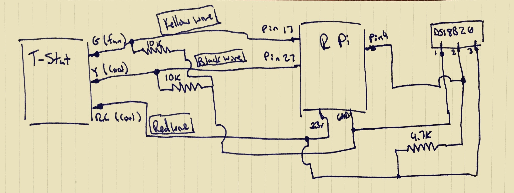
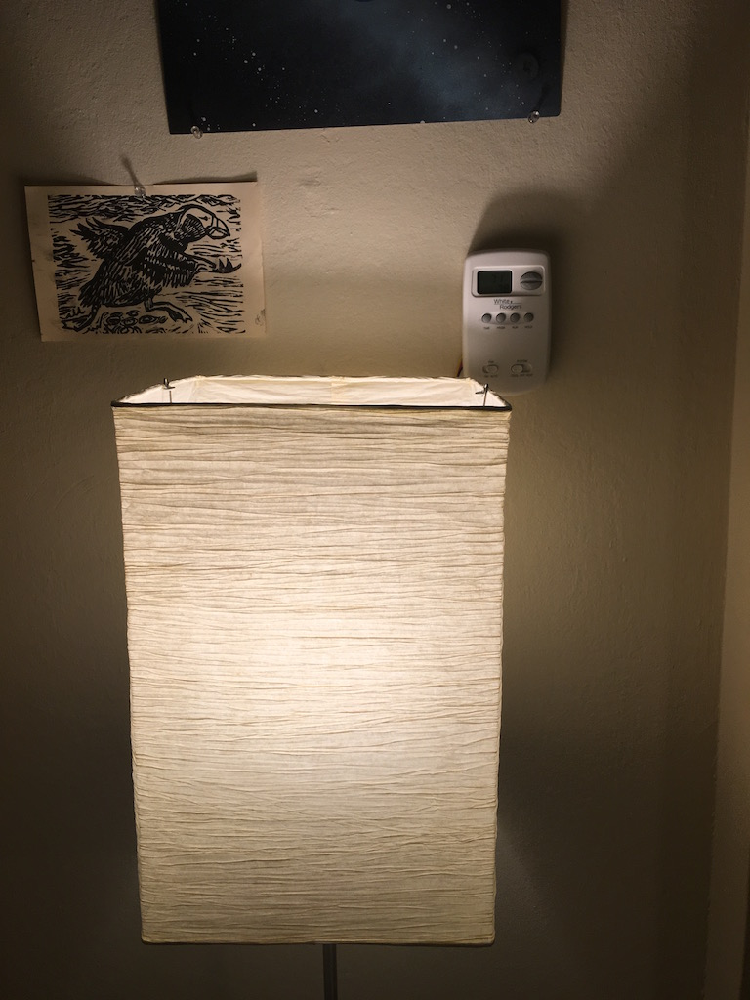
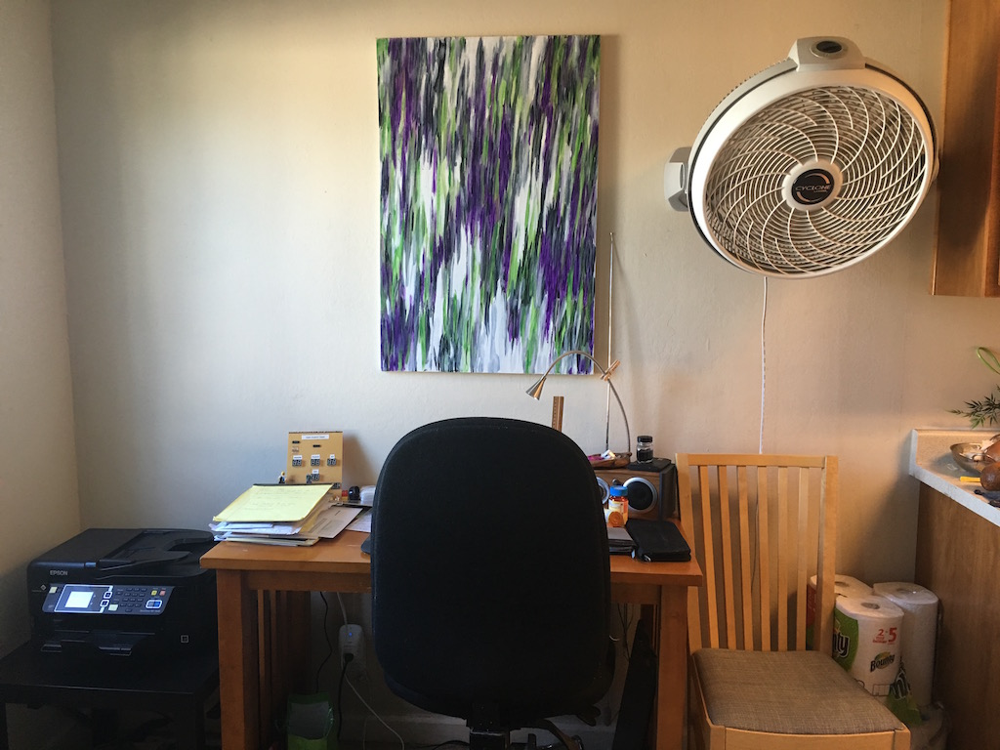
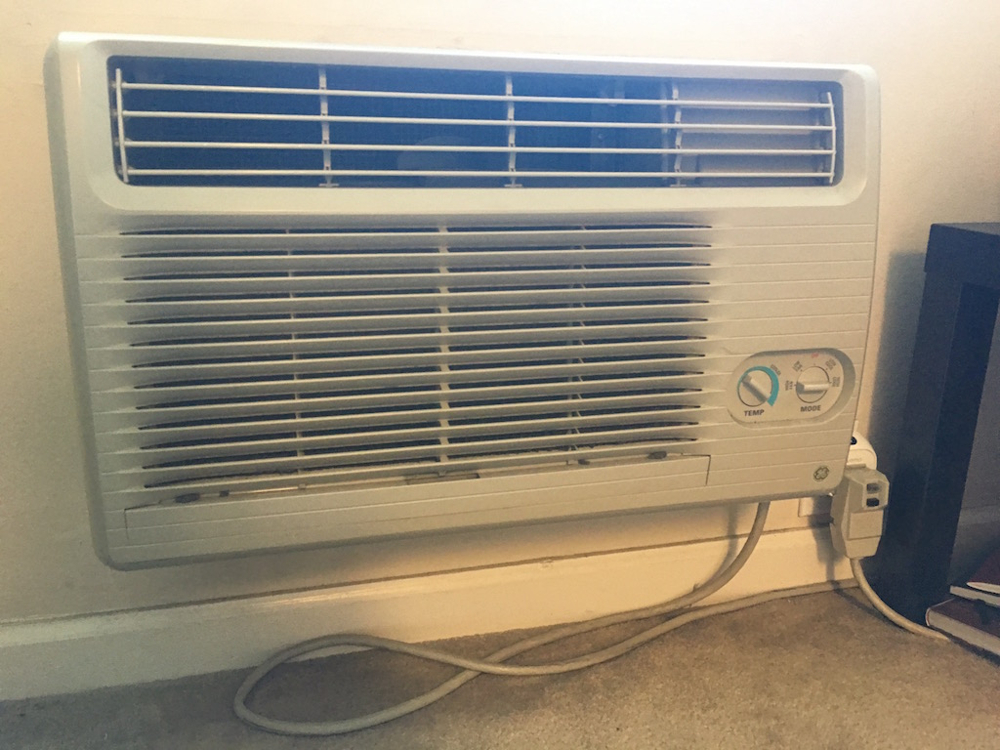

# Thermostat to WeMo

## Why

I live in an apartment and not only do I have a crappy wall air conditioner, I have a crappy wall air conditioner with a manual thermostat that blows cold air only into the kitchen.

My heater has a seperate programmable thermostat that is across the room that I wanted to hook it up so that it to controls the heat and AC.

Diving into the installation guide for my thermostat, I was able to figure out how to hook it up to the GPIO pins on a Raspberry Pi so that the Pi could determine when the thermostat was asking for fan or AC, or both.

I combined this with 2 WeMo switches so I could have the thermostat turn on the wall air conditioner as well as a fan that blows the air from the kitchen to the rest of the apartment.

## How

This script convert signals from the Raspberry PI GPIO pins from my thermostat into on/off actions for WeMo switches that are hooked up to a manual Air Conditioner and box fan.

The script finds all WeMos on the local network, and then chooses the fan and AC Wemos based on serial numbers in your environmental variables (see setup\_template.sh).

I have a picture of my setup in the pictures folder. I have a Raspberry Pi, protoboard and [TP Link TL-WR702N](http://www.amazon.com/TP-LINK-TL-WR702N-Wireless-Repeater-150Mbps/dp/B007PTCFFW?ie=UTF8&psc=1&redirect=true&ref_=oh_aui_detailpage_o09_s00) router (which is acting in client mode) running off of a light bulb outlet right next to the thermostat.

Here is a really rough schematic:

## Pictures

Hooked up:

Hidden:

Fan:

AC Unit:

